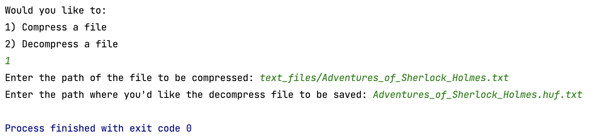

# Huffman Coding Lab

A text file compression program.

User is prompted if they wish to encode or decode a file, then prompt the user for the file path of the file to open, then prompt the user for a filename to save the new file under.  It should then open the file encode or decode the content and save it to the new file path entered.  

Compresses the larger text file examples to almost half their original size. 

## Program:

1. Ask the user if they want to compress of decompress a file.  
2. Get input file path.
3. Get a path to save the new compressed or decompressed file.
4. And then exit.  Your program should **not** remain open between compression and decompression sessions. 

### Example of running the program to compress a file:

### Example of running the program to decompress a file:

## Writing to a binary file. 
One of the things this assignment requires is that you be able for writing a binary string as a binary file, a Storage Class is used.  The Storage driver will take Binary string chunks and store them to a binary file.  It will also open a binary file and return a binary string chunks 8 bits at a time. It also allows to store and read header information that is needed to stash and rebuild your huffman tree. See the StorageDriver.cpp for an example of how to use the Storage Class. 

## Huffman Node and using a priority queue
A Node.h file that can be used for the huffman tree.  When putting Node pointers in a stl priority queue, custom operator overload is implemented to let the queue know how to compare two nodes.  The struct compareWeights in the Node.h file does exactly this.  You can find more information here: https://www.geeksforgeeks.org/stl-priority-queue-for-structure-or-class/

| Requirements Met                                                                                                                                                                                                                                                                              |
|--------|--------------------------------------------------------------------------------------------------------------------------------------------------------------------------------------------------------------------------------------------------------------------------------------------|
| Huffman Tree: Code demonstrates the ability to create a Huffman tree.                                                                                                                                                                                                                  |
| Encoding:  Program is able to encode a string using the Huffman tree.                                                                                                                                                                                                                 |       
| Decoding: Program is able to decode a string using the Huffman tree.                                                                                                                                                                                                                  |       
| File IO:  Program is able to open encode/decode and save a file correctly.  Including some form of storing the a representation of the huffman tree in the encoded file.                                                                                                               |        
| Large Files:  Program is capable of handling large file by incrementally reading in the file while creating and encoding/decoding the Huffman tree.                                                                                                                                   |       
| Short write up, appended to this readme, describing both how to use the program and how it is implemented. |        
| Good coding practices, including: self-commenting variable names, one statement per line, properly indenting and spacing, good  descriptive comments, and a lack of coding errors like memory leaks. **Create documenting comments for each method public and private**  |

## Description below:
The compression algorithm works by first counting the frequency of each unique character in the file. It stores the frequency of each character in an unordered map with character as the key. During this frequency count, the length of this input file is also being tracked for later use in decompression. It then traverses the map and creates a node for each pair of character and frequency. Each node is also loaded into a priority queue during the traversal. The highest priority is given to the character node with lowest frequency/weight. As a result, during the next step when nodes are loaded out of the queue to build the tree, the node with the lowest frequency is taken out first. Two consecutives nodes are taken out during each iteration of the priority queue when building the Huffman tree. These nodes are then the children of a parent node that is created during each iteration. In the end, the nodes in the queue end up being the leaves of the tree while the internal nodes of the tree, with null character follow towards the root with each serving as a position for “1” or “0”. After the iteration, there is one last element in the queue which will serve as the root of the tree. Additionally, during each iteration, the merged node itself is loaded back into the queue, which allows it to create the internal nodes. Once the Huffman tree is built, it’s traversed for each leaf to obtain the code of the character stored at that leaf. The code for each character is stored on a map. This map is then used to create a binary version of the original text, which is written into the binary file in (1KB) chunks at a time, to avoid overhead due to I/O operations. The map is then also used to create the header string (which is also stored in the binary file) that is used in decompression. The header string contains each unique character than its code next to the character and this combination is separated by a separator.

The decompression algorithm works by first getting the header from the binary file, which is then interpreted in order to rebuild the Huffman tree. This header string is traversed in “chunks” separated by the separator. Each “chunk” (or token) contains the text character as the first character in that token and the rest is the Huffman code for that character. Once these codes have been stored in the map, a Huffman tree is then built by creating appropriate nodes for each iteration depending on if “1” or “0” is encountered. Next, the binary version of the file (stored in string) is traversed, while also walking through the Huffman tree based on if “0” or “1” is encountered, once the leaf node of the tree is encountered, it will obtain the letter from it and write it to the decoded text file.
